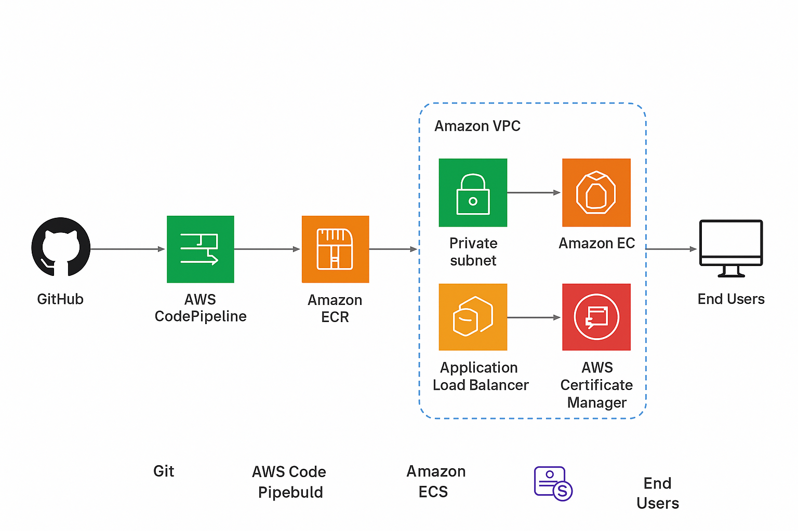

## 📌 Project Architecture



### Services Used
- Amazon VPC (with public/private subnets, NAT, IGW)
- Amazon EC2 (for ECS cluster instances)
- Amazon ECS (EC2 launch type) (container orchestration)
- Amazon ECR (stores Docker images)
- Auto Scaling Group (scales EC2 instances for ECS)
- Application Load Balancer (ALB) (traffic distribution, HTTPS via ACM)
- Amazon Route 53 (DNS with GoDaddy domain integration)
- AWS Certificate Manager (ACM) (SSL certificate)
- AWS CodePipeline + CodeBuild (CI/CD automation)
- IAM (permissions & roles)


🚀 AWS Deployment Steps
This project was deployed on AWS Cloud using the following steps:

1. Created ECR Repository
Logged into AWS Management Console → ECR.
Created a repository named netflix-clone.
This repository stores the Docker image of the application.

2. Built and Pushed Docker Image

Built Docker image locally (or via CodeBuild):
docker build -t netflix-clone .
docker tag netflix-clone:latest <account-id>.dkr.ecr.<region>.amazonaws.com/netflix-clone:latest
docker push <account-id>.dkr.ecr.<region>.amazonaws.com/netflix-clone:latest

3. Created ECS Cluster & Task Definition

Created an ECS Cluster (EC2 or Fargate launch type).
Defined a Task Definition with:
Container name: netflix-container
Image: Pulled from ECR (netflix-clone:latest)
Port mapping: 80 → 80

4. Deployed Service in ECS

Created a Service in ECS using the Task Definition.
Configured desired number of tasks (containers).
ECS automatically launched and managed containers.

5. Configured Application Load Balancer (ALB)

Created an Application Load Balancer.
Configured a Target Group for ECS tasks.
Linked the ECS Service to the ALB.
This allowed traffic distribution across containers.

6. (Optional) Setup CI/CD with CodePipeline

Connected GitHub Repo to AWS CodePipeline.
Configured Source Stage → GitHub.
Configured Build Stage → AWS CodeBuild (using buildspec.yml).
Configured Deploy Stage → ECS Service.
Now, every code push triggers automatic deployment.

7. (Optional) Added Domain & SSL

Used Route 53 to map a custom domain to the ALB DNS.
Used AWS Certificate Manager (ACM) to enable HTTPS (SSL/TLS).


# Netflix Clone – AWS ECS/ECR/ALB Deployment

This is a simple Netflix-like landing page, containerized with Docker, and deployable on AWS ECS behind an Application Load Balancer.

## Run Locally
```bash
docker build -t netflix:v1 .
docker run -p 80:80 netflix:v1
```
Then open `http://localhost` in your browser.
